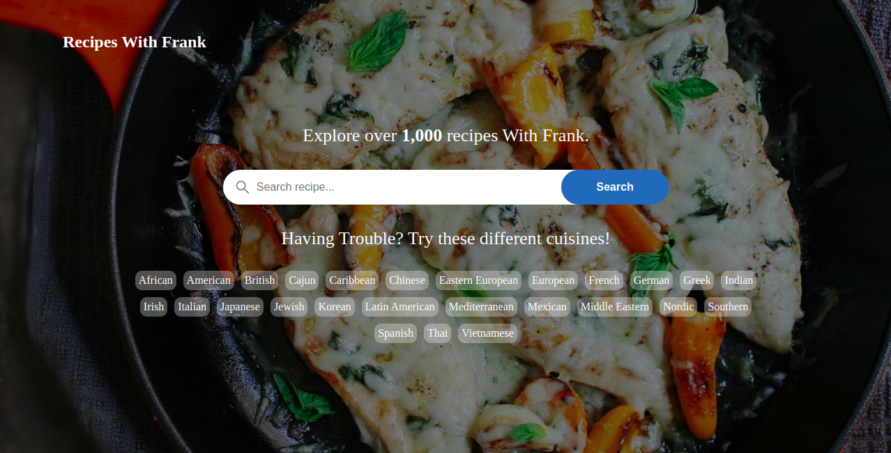
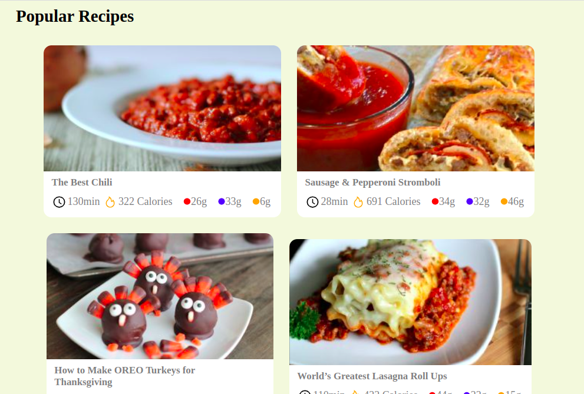
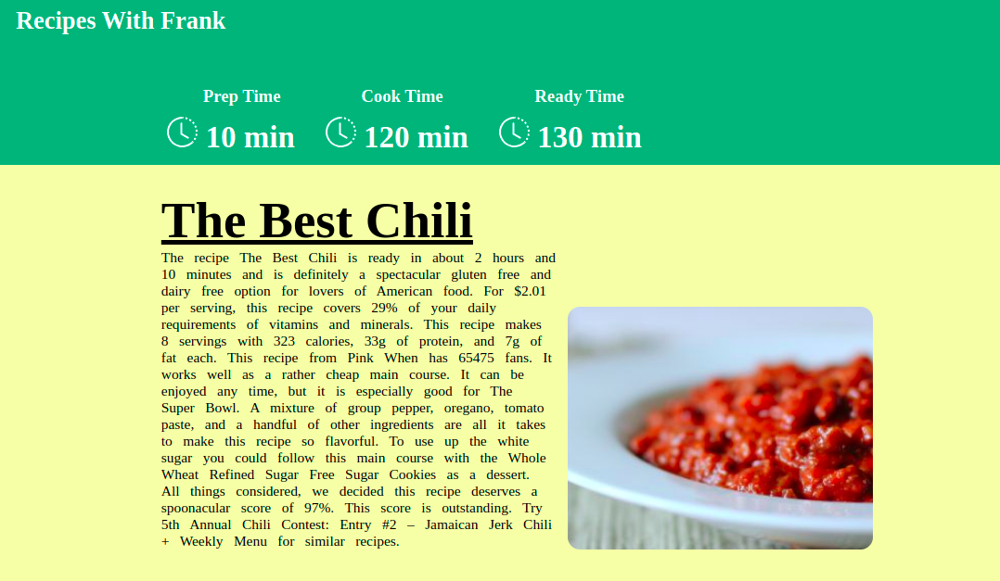
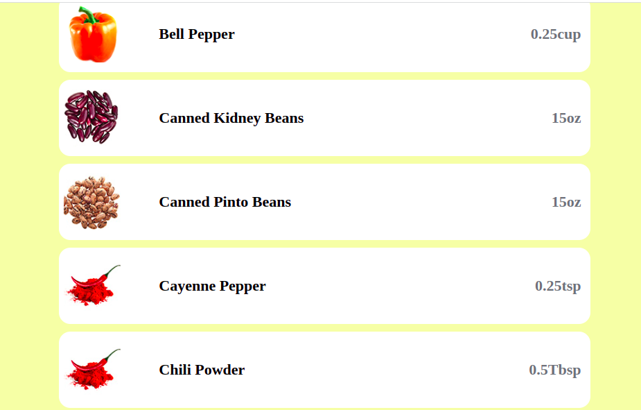
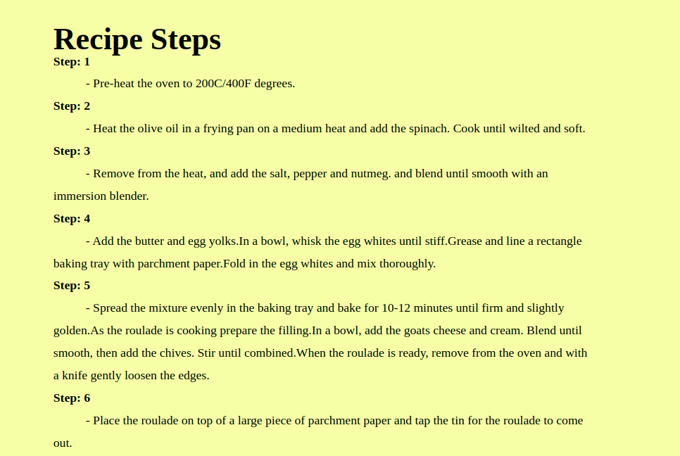

# RecipesWithFrank

## Discription
Recipes With Frank is a collaborative mock recipes web application. The idea came from the [Carb Manager](https://www.carbmanager.com/recipes). This application provides the user an array of recipies to choose from. Once a recipe has been choosen, the user can view the discription, ingredients and steps to making the recipe.

## Getting Started
- Clone the repository
- Navigate into the directory where you cloned your repository
- Install the dependencies 
```
npm install
```
- then you can run the app my doing 
```
npm run dev
```

# Features
- Users can view the *Home Page*. Which will display a search option. Along with an array of recipe choices to choose out of curiosity.


- A user can view suggested *Popular Recipes* out of curiousity.


- When a user chooses a recipe. The discription and picture of that recipe can be viewed. 


- On this page, A user will be able to see both the ingredients needed for the recipe, along with the steps to create the recipe.



# Build
- React
- Node
- Css
- Styled-components

# Credits
- [Frank](https://github.com/Frank-5850)
- [Ariel](https://github.com/AriAgress)
- [Angel](https://github.com/angelz510)
- [Akiko](https://github.com/keeks5456)
- [Seena](https://github.com/seenanadimi)